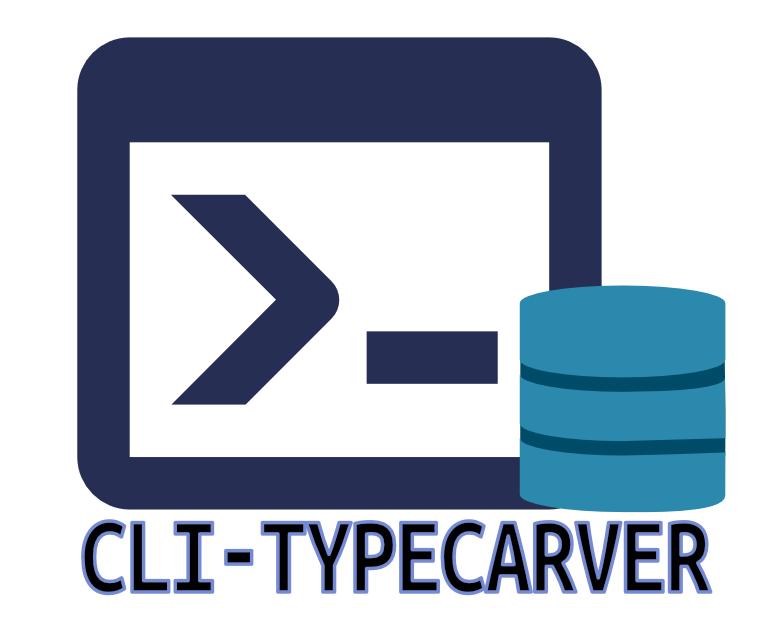

# CLI Tool to generate TypeScript interfaces from a MySQL database schema.



- Tool created using the lib [database-to-interfaces](https://raw.githubusercontent.com/EdwinGeul01/cli-typecarver/refs/heads/main/typecaver.png) to generate TypeScript interfaces from a MySQL database schema.

## How to use

1. install the dependencies globally:

   ```bash
   npm install -g database-to-interfaces
   ```

2. create a configuration file `configDatabase.config` in the root of your project with the following content:

   ```yaml
   port: 3306
   host: localhost
   user: root
   password: 1234
   database: midb
   filename: ./interfacesdb.ts
   filepath: ./a/
   ```

3. run the tool in the same directory as the configuration file:

   ```bash
   npx get-database-interfaces
   ```

## Configuration file | content 🧾

- `port`: the port of the MySQL server (default: 3306)
- `host`: the host of the MySQL server (default: localhost)
- `user`: the user to connect to the MySQL server (default: root)
- `password`: the password to connect to the MySQL server (default: empty)
- `database`: the name of the database to connect to (default: empty)
- `filename`: the name of the file where the interfaces will be generated (default: interfaces)
- `filepath`: the path where the file will be generated (default: ./)
- `prefix`: the prefix to add to the interfaces (default: empty) , for example 'DB\_' will generate interfaces like `DB_User`, `DB_Product`, etc.
- `dbType`: the type of database to connect to (default: mysql) , currently only supports `mysql` and `postgresql`.

## Help ⛑️

- you can also use the template file `configDatabase.config.template` to create your own configuration file., just remove the `.template` extension and fill in the values.
